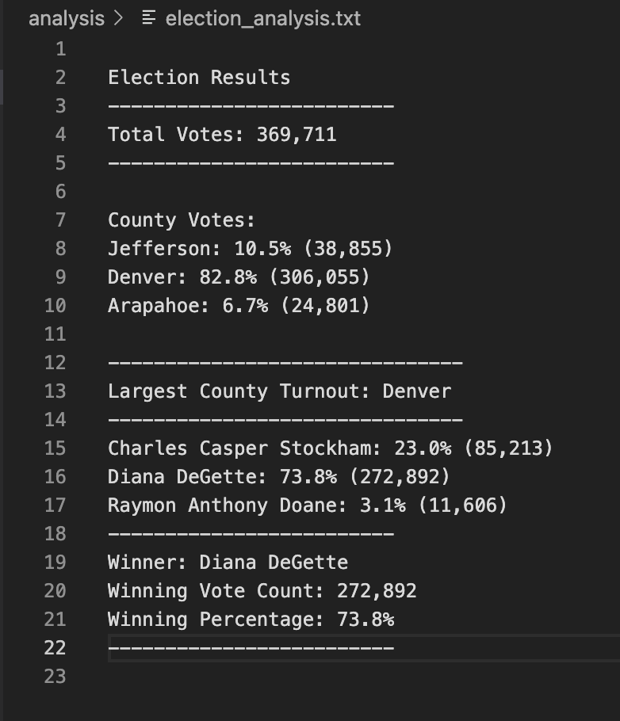

# Election Analysis
## Purpose of the Election Analysis is Well Defined
After helping Seth and Tom with their initial request for election data. They have asked for additional data:
Additional request are:
- The Voter Turnout per County
- Percentage of votes for each county
- Based on total vote count
- Country with highest turnout.

## Election Result
List of each election outcomes that is addressed

How many Votes were cast in this congreessional election ?
  Looks like there were 369,711 total votes case in this election.

Provide a breakdown of the number of votes and the percentage of total votes for each county in the percent
  Jefferson county 38,855 turnout votes and 10.5%
  Denver county 306,055 turnout votes and 82.8%
  Arapahoe county 24,801 turnout votes and 6.7%

Which county had the largest number of votes ?
  Dever county has the highest number of votes 306,065 out of 369,711
  
Provide a breakdown of the number of the votes 
  Charles casper Stockham: 23.0% Total Votes Cast with 85213 Total Votes
  Diana DeGette 73.0% Total Votes Cast with 272,892 Total Votes
  Raymon Anthony Doane 3.1% Total Votes Cast with 11,606 Total Votes
  
Which candiate won the election, what was their vote count, and what was their percentage of the total vote ?
  Diana DeGette won the election with total 272,892. Total votes cast 73.8 %

## Election Summary
The script can be expanded or modified to show information for the election. The code was modified to show Total Votes, County Votes, Largest County turnout, and winner candiate from county with the highest votes. 

Regardless of any election this script can be use in future. Two examples that can use one is election results containing 3 columns with adding fourth column for "Political party. Second one can use to understand what is the voters age. 
Example:
1. Adding fourth column "Political party"
   - Votes per political
   - Vote percentage for political party out of total votes
2. Add "Age" column
   - Which age group has the highest voters?
   - Which age group responsuble for the winner and loser of the election
   - Which age group supports the political party ?

There alot of ideas that can be implemented into the code to future election. But the examples above can give a little idea or hint what future programmers or client do with using the script given. 
